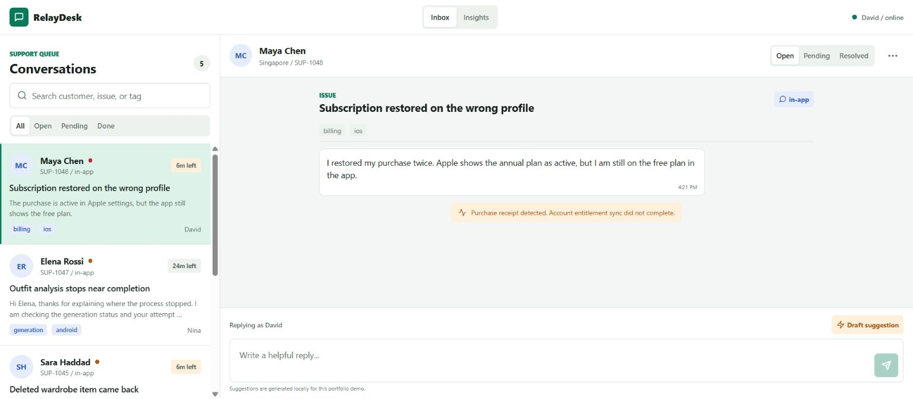
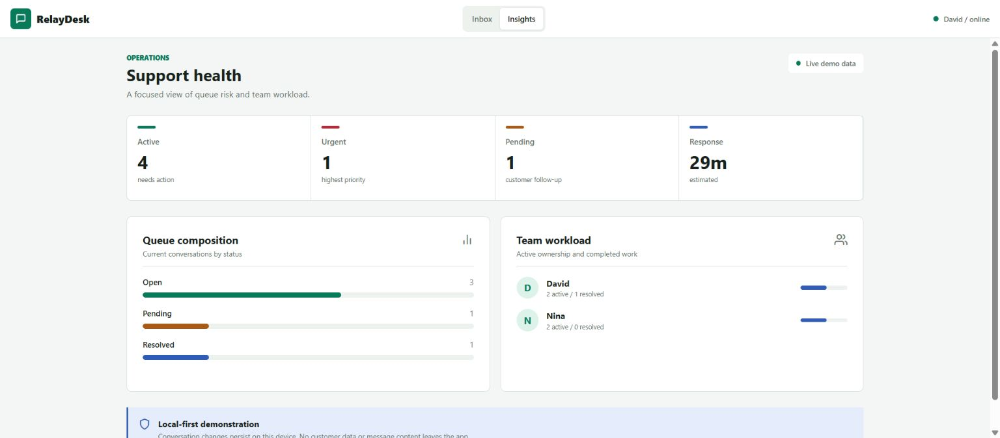

# RelayDesk Mobile

[](https://github.com/favrora/mobile-support-desk/actions/workflows/ci.yml)


RelayDesk is a production-style support operations workspace for Android, iOS, and the web. It
demonstrates responsive React Native architecture, deterministic state transitions, offline
persistence, accessibility, and operational UI design without relying on a backend.



<details>
  <summary>Queue insights</summary>

  
</details>

## Product surface

- Prioritized support queue with full-text search and status filters
- SLA countdowns, overdue states, channels, tags, and ownership
- Conversation history with system diagnostics and agent replies
- Context-aware local reply drafts with transparent demo labeling
- Queue health, workload, response-time, and status insights
- Compact mobile navigation and side-by-side desktop workflow
- Local persistence through AsyncStorage

All people, messages, and operational metrics are fictional seed data. The app sends no customer
data to a remote service.

## Architecture

```text
src/app                 Expo Router entry points
src/screens             Responsive screen composition
src/components          Reusable accessible UI controls
src/features/tickets    Domain model, reducer, selectors, storage, and feature UI
src/theme.ts            Shared visual tokens
```

Business rules are framework-independent functions in `logic.ts`. React owns orchestration,
AsyncStorage is isolated behind a small adapter, and the view switches between compact and desktop
layouts without duplicating domain state. See [ARCHITECTURE.md](ARCHITECTURE.md) for the decisions and
tradeoffs.

## Run locally

Requires Node.js 20 or newer.

```bash
npm ci
npm start
```

Use `npm run android`, `npm run ios`, or `npm run web` for a specific platform.

## Quality gates

```bash
npm run check
```

The check pipeline runs Expo ESLint, strict TypeScript validation, Vitest domain tests, and a static
web export. The same pipeline runs in GitHub Actions for every push and pull request.

## License

[MIT](LICENSE)
